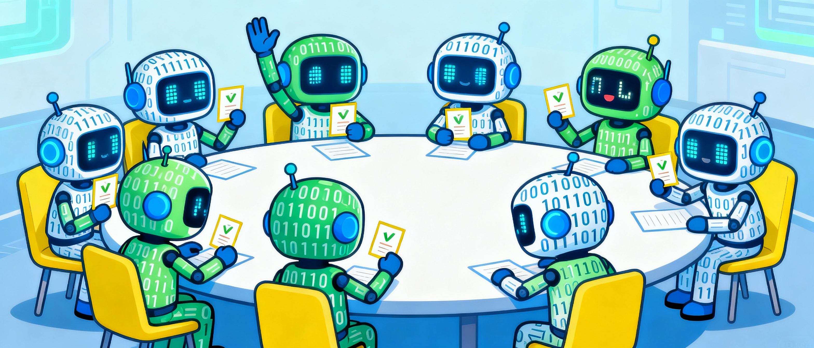
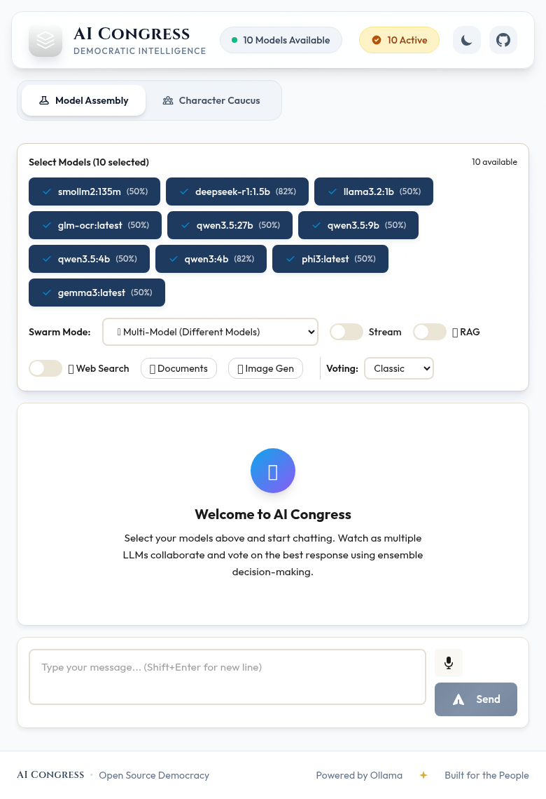
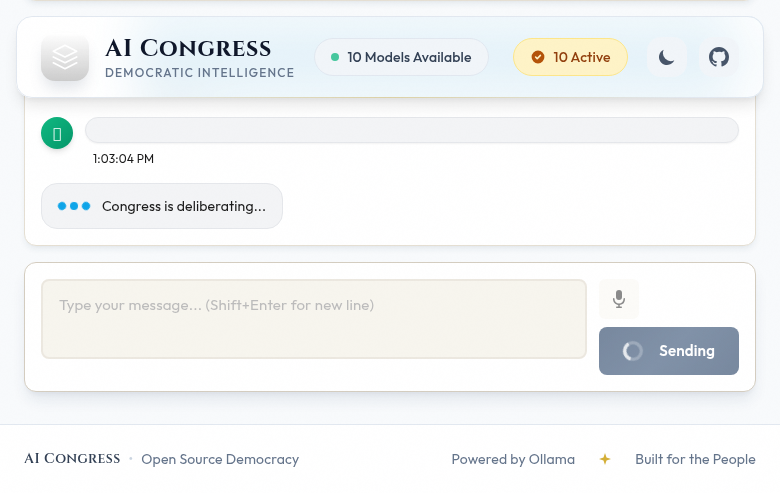
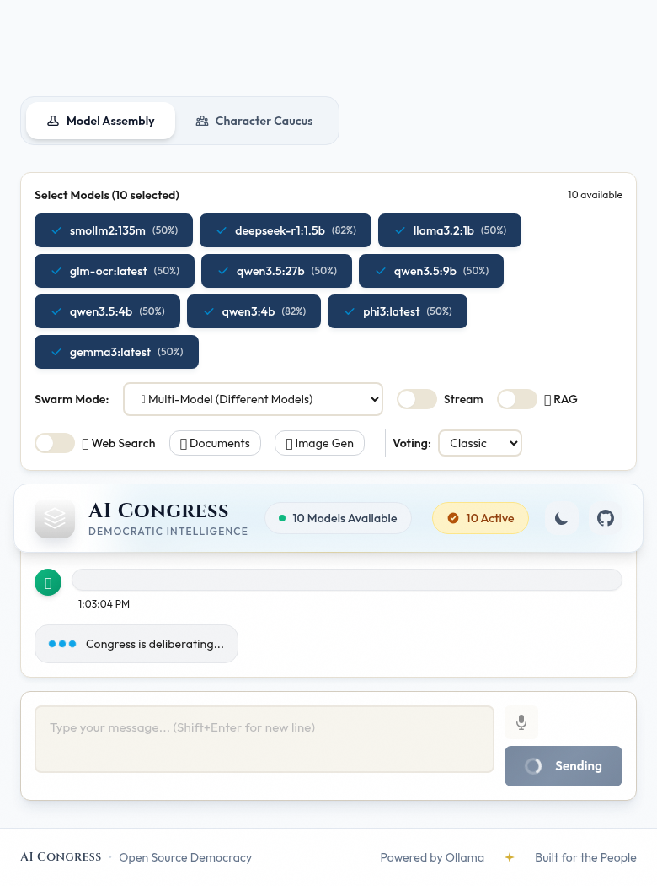

# AI Congress


AI Congress is an autonomous LLM multi-agent system where different LLMs collaboratively vote on responses using weighted ensemble decision-making. Features 35 intelligence improvements including role-based agent specialization, structured debate, evidence-grounded reasoning, adaptive learning, and full observability via Oracle 26ai.

## Screenshots

| Model Selection | Deliberation | Results |
|:-:|:-:|:-:|
|  |  |  |

## Key Capabilities

- **5 Swarm Modes**: Multi-model, multi-request, hybrid, personality, enhanced (with all 35 improvements)
- **Semantic Voting**: LLM-based clustering groups responses by meaning, not string matching
- **Multi-Round Debate**: Pressure prompts, conviction tracking, devil's advocate protocol
- **Role-Based Agents**: Planner, Worker, Critic, Judge, Synthesizer with personality-driven assignment
- **Advanced Reasoning**: Chain-of-Thought (CoT), ReAct with real tools (web search, calculate)
- **RAG Integration**: Document upload, chunking, vector search augmented into swarm queries
- **Learning & Adaptation**: Dynamic weight adjustment, user feedback loop, confidence calibration
- **Full Observability**: Oracle 26ai data lake, debate replay, decision explanations, performance profiling

## Quick Start

<!-- one-command-install -->
> **One-command install** — clone, configure, and run in a single step:
>
> ```bash
> curl -fsSL https://raw.githubusercontent.com/jasperan/ai-congress/main/install.sh | bash
> ```
>
> <details><summary>Advanced options</summary>
>
> Override install location:
> ```bash
> PROJECT_DIR=/opt/myapp curl -fsSL https://raw.githubusercontent.com/jasperan/ai-congress/main/install.sh | bash
> ```
>
> Or install manually:
> ```bash
> git clone https://github.com/jasperan/ai-congress.git
> cd ai-congress
> # See below for setup instructions
> ```
> </details>


### Prerequisites
- Python 3.11+
- Ollama installed and running (`ollama serve`)
- Node.js 18+ (for frontend)

### Installation

```bash
./startup.sh
```

### Usage

#### CLI

```bash
./run_cli.py                                        # Interactive menu
./run_cli.py chat "What is 2+2?" -m phi3:3.8b -m mistral:7b
./run_cli.py chat "Solve this puzzle..." --reasoning cot
./run_cli.py chat "Calculate 25 * 48" --reasoning react
./run_cli.py models                                 # List available models
```

#### Web Interface

```bash
python run_server.py          # Backend at :8000
cd frontend && npm run dev    # Frontend at :3000
```

#### Enhanced Mode (API)

```bash
curl -X POST http://localhost:8000/api/chat/enhanced \
  -H "Content-Type: application/json" \
  -d '{
    "prompt": "What caused the 2008 financial crisis?",
    "models": ["phi3:3.8b", "mistral:7b", "llama3.2:3b"],
    "enable_decomposition": true,
    "enable_debate": true
  }'
```

## Architecture

```
Web UI / CLI / API
    |
    v
FastAPI (:8000)
    |
    +---> SwarmOrchestrator (standard modes)
    |         |
    +---> EnhancedOrchestrator (enhanced mode with 35 improvements)
    |         |
    |         +---> Intelligence Layer (role prompts, reasoning router, MoE routing)
    |         +---> Coordination Layer (circuit breaker, coalitions, adaptive timeouts)
    |         +---> Debate Layer (structured argumentation, devil's advocate, evidence-grounded)
    |         +---> Voting Layer (ensemble voting, confidence calibration, minority report)
    |         +---> Learning Layer (dynamic weights, user feedback, personality persistence)
    |         +---> RAG Layer (document fusion, multi-source, attribution)
    |         +---> Observability Layer (profiler, decision explainer, debate replay)
    |
    +---> ACP (Agent Communication Protocol)
    |         +---> Message Bus (direct, broadcast, room channels)
    |         +---> Agent Registry (role/capability queries)
    |         +---> Supervision (OTP-style retry with backoff)
    |         +---> Role Dispatcher (personality -> role mapping)
    |         +---> Hash Anchoring (deterministic response references)
    |
    +---> Integrations
    |         +---> Web Search (DuckDuckGo, SearXNG, Yacy)
    |         +---> Voice (Whisper transcription)
    |         +---> Image Gen (Stable Diffusion)
    |         +---> Documents (PDF, DOCX, XLSX parsing)
    |         +---> Oracle Vector Store
    |
    +---> Data Lake (Oracle 26ai Free)
              +---> Sessions, Events, Responses, Votes, Debates
```

## The 35 Intelligence Improvements

### Category 1: Agent Intelligence Patterns
| # | Feature | Description |
|---|---------|-------------|
| 1 | Cascading Query Decomposition | Planner breaks complex queries into sub-questions routed to different workers |
| 2 | Role-Differentiated Prompting | Each role (Planner/Worker/Critic/Judge/Synthesizer) gets tailored system prompts |
| 3 | Adaptive Reasoning Mode | Auto-selects CoT, ReAct, or direct based on query type |
| 4 | Tool-Augmented ReAct | ReAct agents use real web search, calculations, and document retrieval |
| 5 | Self-Verification Loop | Extracts claims from answers, web-searches each one for fact-checking |
| 6 | Memory-Augmented Agents | Short-term and long-term memory for coherent multi-turn conversations |
| 7 | Query Domain Classification | Classifies queries (math, coding, science, etc.) for model routing |
| 8 | Chain-of-Agents | Sequential reasoning chains: Researcher -> Analyst -> Synthesizer -> Critic |
| 9 | Hypothesis Explorer | Forces models to generate multiple ranked hypotheses |
| 10 | Meta-Cognitive Monitoring | Models assess their own uncertainty, common blind spots surfaced |
| 11 | Adversarial Robustness Testing | Paraphrase testing to verify answer consistency |
| 12 | Mixture of Experts Routing | Routes queries to the best models per domain |

### Category 2: Voting & Consensus
| # | Feature | Description |
|---|---------|-------------|
| 13 | Multi-Algorithm Ensemble Voting | Runs weighted majority + temperature ensemble + confidence-based, then meta-votes |
| 14 | Confidence Calibration | Tracks predicted vs actual accuracy, applies calibration curves |
| 15 | Minority Report | Surfaces the strongest dissenting view alongside the consensus |
| 16 | Conviction-Weighted Voting | Models holding consistent positions get higher voting weight |
| 17 | Contextual Algorithm Selection | Auto-selects best voting algorithm based on query type |

### Category 3: Debate & Deliberation
| # | Feature | Description |
|---|---------|-------------|
| 18 | Structured Argumentation | Toulmin model: Claim, Evidence, Warrant, Qualifier, Rebuttal |
| 19 | Devil's Advocate Protocol | One model argues against the majority to stress-test consensus |
| 20 | Evidence-Grounded Debate | Web search results injected into debate rounds |
| 21 | Dynamic Debate Depth | 0-4 rounds based on consensus level (skip if >0.8, extend if <0.2) |
| 22 | Cross-Examination Protocol | Models directly question each other using hash anchors |

### Category 4: Agent Coordination
| # | Feature | Description |
|---|---------|-------------|
| 23 | Enhanced Orchestrator API | Full pipeline accessible via `/api/chat/enhanced` |
| 24 | Agent Handoff | Capability-based task delegation between agents |
| 25 | Coalition Formation | Similar responses grouped before voting to prevent vote splitting |
| 26 | Personality-Driven Communication | Communication style (formal/casual) shapes system prompts |
| 27 | Circuit Breaker | Failing models auto-skipped with CLOSED/OPEN/HALF_OPEN states |
| 28 | Graceful Degradation | System adapts mode based on available models (full -> simplified -> single) |
| 29 | Adaptive Timeouts | Per-model timeouts based on historical latency (3x EMA) |

### Category 5: Learning & Adaptation
| # | Feature | Description |
|---|---------|-------------|
| 30 | Dynamic Weight Adjustment | Model weights updated via EMA based on win rate |
| 31 | User Feedback Loop | Thumbs up/down on responses adjusts model weights |
| 32 | Prompt Template Evolution | A/B tests debate prompts, promotes winners |
| 33 | Personality Persistence | Emotional state persists across sessions |
| 34 | Benchmark Auto-Update | Placeholder for periodic self-evaluation |

### Category 6: Observability
| # | Feature | Description |
|---|---------|-------------|
| 35 | Decision Explanation | Auto-generated explanation of why consensus was reached |

Plus: Performance profiling, debate replay, chunk-level attribution, minority reports.

## API Endpoints

| Method | Endpoint | Description |
|--------|----------|-------------|
| `GET` | `/api/models` | List available Ollama models with weights |
| `POST` | `/api/chat` | Standard chat (multi_model, multi_request, hybrid, personality) |
| `POST` | `/api/chat/enhanced` | Enhanced chat with all 35 improvements |
| `WS` | `/ws/chat` | WebSocket streaming chat |
| `POST` | `/api/feedback` | Submit user feedback on responses |
| `GET` | `/api/enhanced/stats` | Performance statistics |
| `GET` | `/api/enhanced/runs/{id}` | Get details of a specific run |
| `POST` | `/api/documents/upload` | Upload documents for RAG |
| `GET` | `/api/documents/list` | List uploaded documents |
| `POST` | `/api/audio/transcribe` | Voice transcription |
| `POST` | `/api/search/web` | Web search |
| `POST` | `/api/images/generate` | Image generation |
| `GET` | `/api/personalities` | List personality sets |

## Configuration

All configuration in `config/config.yaml`:

```yaml
ollama:
  base_url: "http://127.0.0.1:11434"
  timeout: 120
  max_retries: 3

swarm:
  default_mode: multi_model
  max_concurrent_requests: 50

voting:
  default_algorithm: weighted_majority
  semantic_confidence_threshold: 0.6
  debate:
    max_rounds: 3
    temp_schedule: [0.9, 0.5, 0.2]
```

Model weights in `config/models_benchmark.json` (0.0-1.0 accuracy scores).
Personality traits in `config/models_personality.json` (Big Five + emotional state).

## Project Structure

```
src/ai_congress/
  core/
    swarm_orchestrator.py       # Standard orchestration (5 modes)
    enhanced_orchestrator.py    # Enhanced orchestration (35 improvements)
    voting_engine.py            # Voting algorithms
    semantic_voting.py          # LLM-based semantic clustering
    debate_manager.py           # Multi-round debate
    model_registry.py           # Model management
    rag_engine.py               # RAG pipeline
    ollama_client.py            # Async Ollama wrapper
    acp/                        # Agent Communication Protocol (11 modules)
    intelligence/               # Intelligence patterns (11 modules)
    voting/                     # Enhanced voting (4 modules)
    debate/                     # Enhanced debate (5 modules)
    coordination/               # Agent coordination (4 modules)
    learning/                   # Learning & adaptation (4 modules)
    rag/                        # Enhanced RAG (3 modules)
    observability/              # Observability (3 modules)
    personality/                # Personality profiles & emotional voting
    reasoning/                  # CoT & ReAct agents
  api/                          # FastAPI server
  cli/                          # CLI interface
  datalake/                     # Oracle 26ai data lake
  integrations/                 # Web search, voice, image gen, documents
  utils/                        # Config, benchmarks, logging
frontend/                       # Svelte 4.2 + Tailwind
config/                         # YAML config, benchmarks, personalities
tests/                          # Pytest suite
```

## Docker

```bash
docker-compose up -d                          # API + Frontend
docker-compose -f docker-compose.searxng.yml up  # With SearXNG search
```

## Testing

```bash
python -m pytest tests/ -v
```

## Documentation

See **[AGENT_HARNESS_ANNEX.md](AGENT_HARNESS_ANNEX.md)** for detailed documentation on reasoning strategies, communication protocols, and architecture.

---

<div align="center">

[](https://github.com/jasperan)&nbsp;
[](https://www.linkedin.com/in/jasperan/)&nbsp;
[](https://www.oracle.com/database/free/)

</div>
